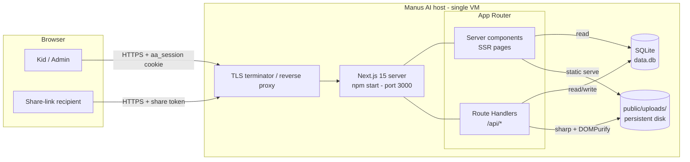
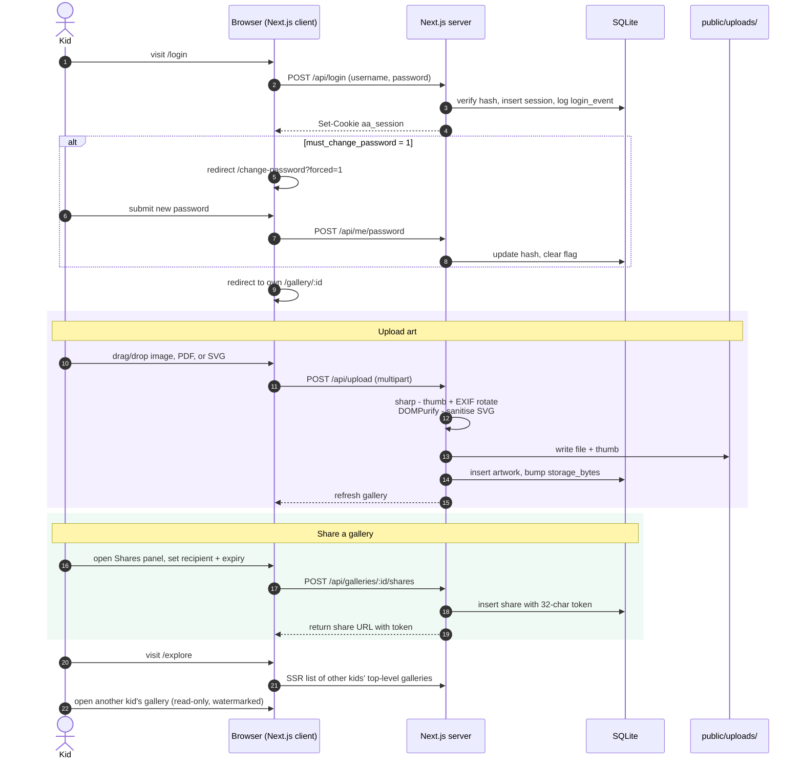
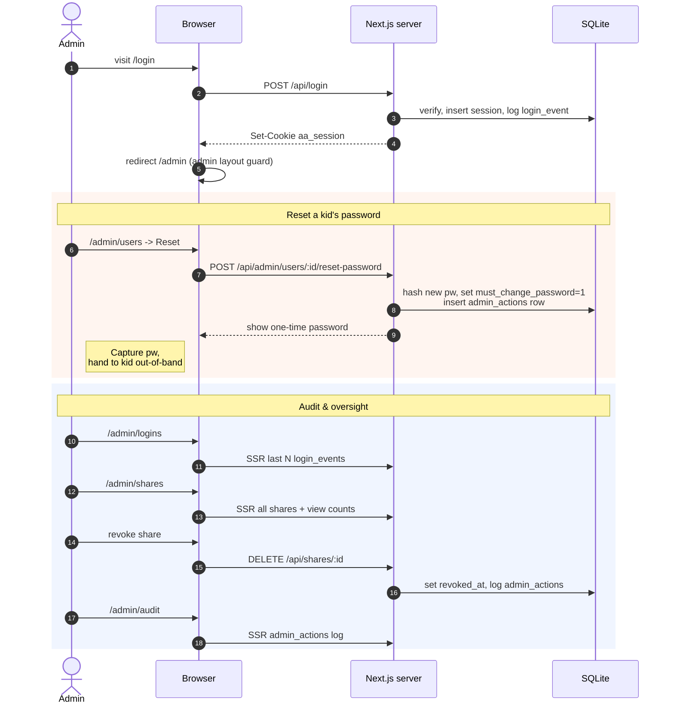

# Architecture

A single-host Next.js app with SQLite + local-disk uploads. No external services beyond DNS and TLS termination. Hosted on Manus AI.

## Deployment topology



### Trust boundaries

- Cookie auth (`aa_session`, httpOnly, sameSite=lax, `secure` in prod) gates `/api/*` mutations and owned-gallery views.
- Share tokens (32-char URL-safe) gate `/share/[token]` reads only — no login required, sub-gallery descent via `?g=<id>` is verified by walking the gallery tree.
- Rate limit: 10 failed logins / username / 10 min (recorded in `login_events`).
- SVG uploads are sanitised server-side by DOMPurify before being written to disk; raster thumbnail generated by sharp.

### Persistence

`data.db` (+ `-wal`, `-shm`) and `public/uploads/` **must** live on a persistent volume. The app is **not** serverless-compatible — `better-sqlite3` opens a local file and uploads are written next to the binary.

---

## Kid workflow



Key paths:
- `/gallery/:id` — owned (edit) vs. read-only depending on `gallery.user_id === user.id`.
- `/explore` — browse other kids' top-level galleries.
- `/change-password` — voluntary or forced (`?forced=1`).

## Admin workflow



Admin has no gallery of their own; admin pages are guarded by `app/admin/layout.tsx` (`role === 'admin'`).

## Share-recipient workflow

```mermaid
sequenceDiagram
  autonumber
  actor Recipient as Recipient (no login)
  participant UI as Browser
  participant Server as Next.js server
  participant DB as SQLite
  participant FS as public/uploads/

  Recipient->>UI: visit /share/TOKEN (optionally ?g=N)
  UI->>Server: SSR share lookup
  Server->>DB: find share by token
  alt revoked or expired
    Server-->>UI: 404
  else valid
    Server->>Server: if ?g=N, verify isDescendant(N, share.gallery_id)
    Server->>DB: insert share_views (IP, UA)
    Server->>DB: list sub-galleries + artworks
    Server-->>UI: render read-only gallery<br/>with owner-name watermark
  end
  Recipient->>UI: click thumbnail
  UI->>UI: open lightbox (zoom/rotate/pan;<br/>NoDownloadGuard blocks right-click + drag)
  UI->>FS: GET /uploads/FILE (full resolution)
```

Notes on recipient experience:
- No account, no cookie. Token is the only credential.
- `NoDownloadGuard` is a soft mitigation only (right-click off, drag off, watermark, PDF toolbar hidden) — **not DRM**. Screenshots remain possible.
- Sub-gallery breadcrumb stays inside the shared subtree; descending out of it returns 404.
